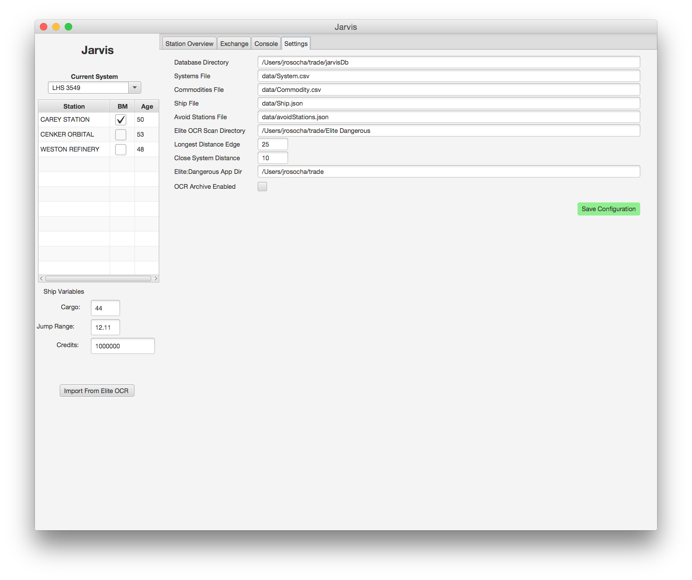
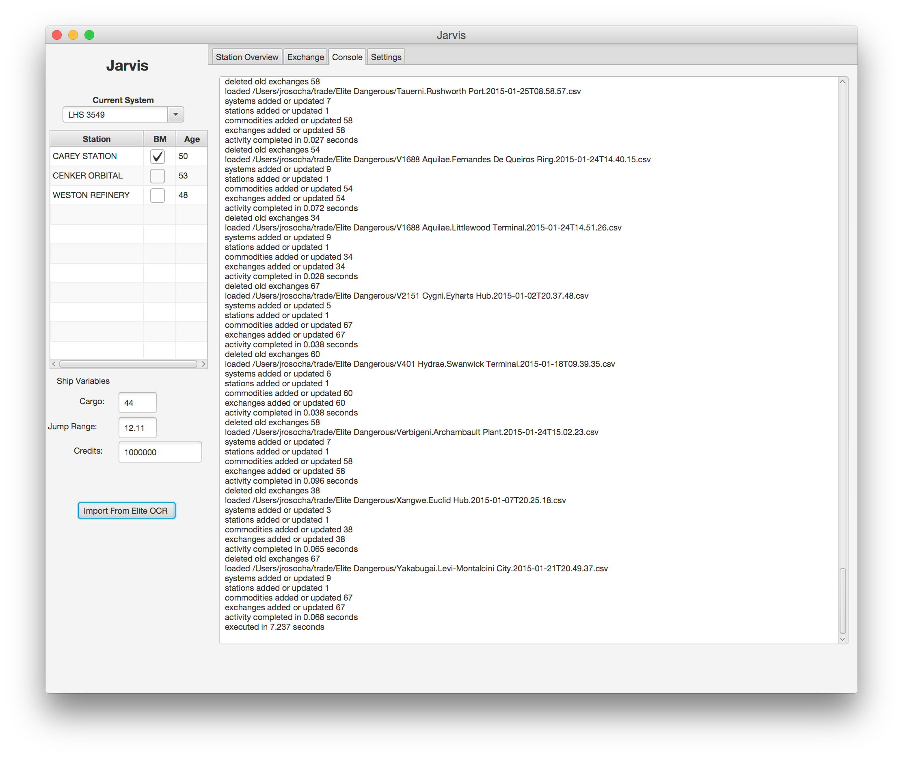
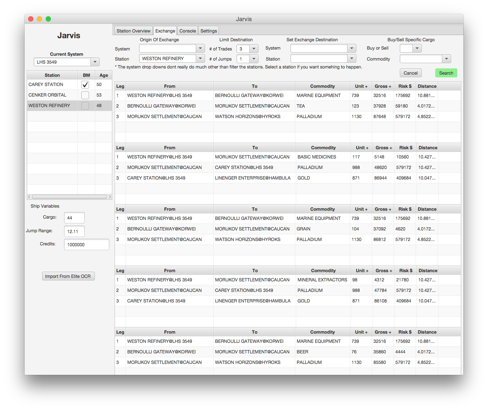
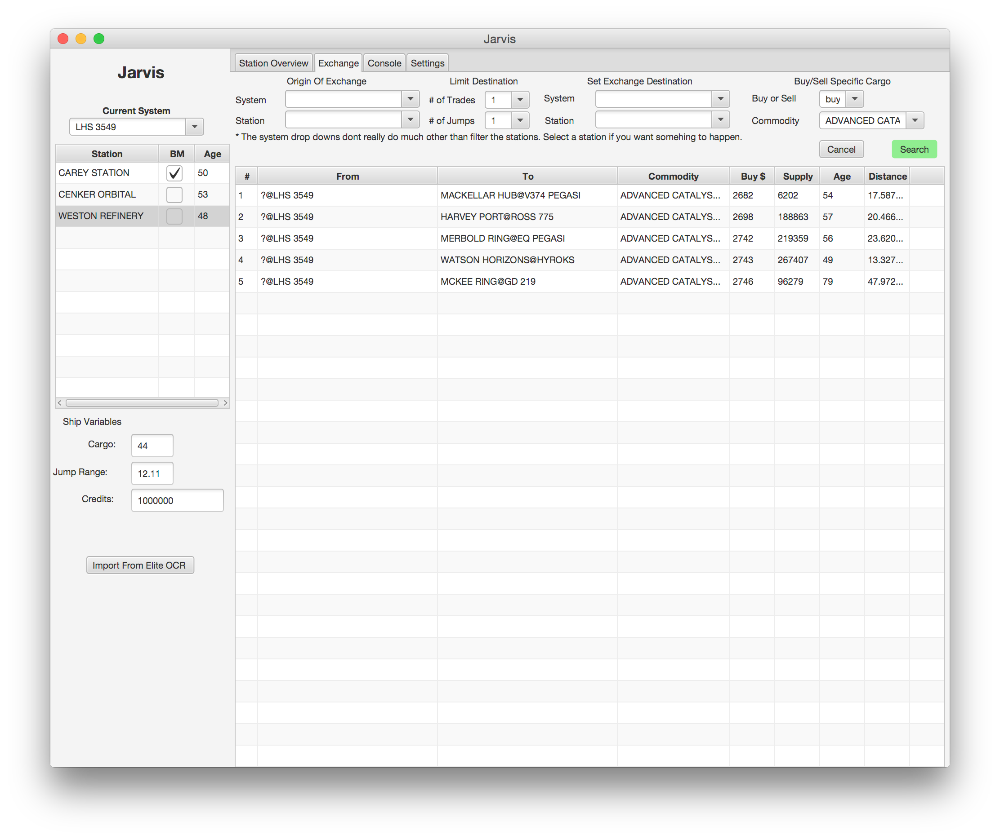
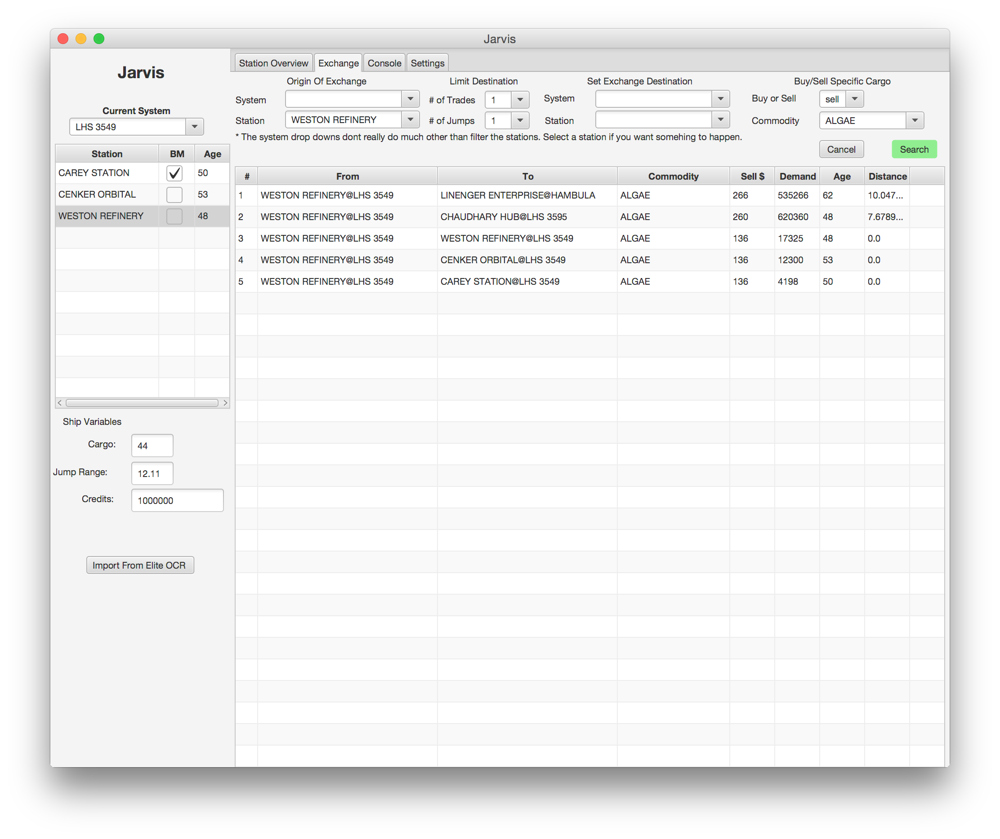
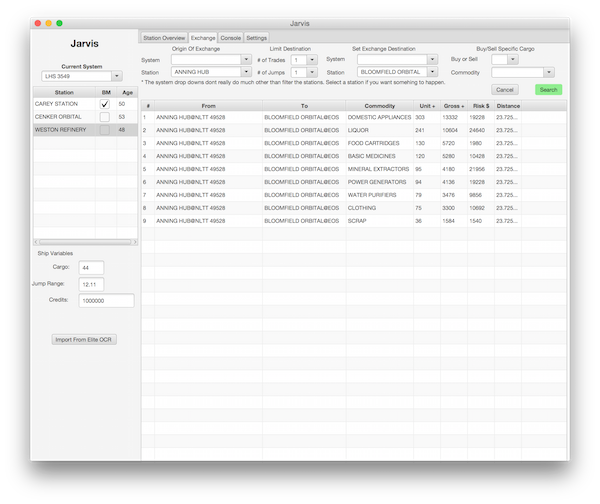
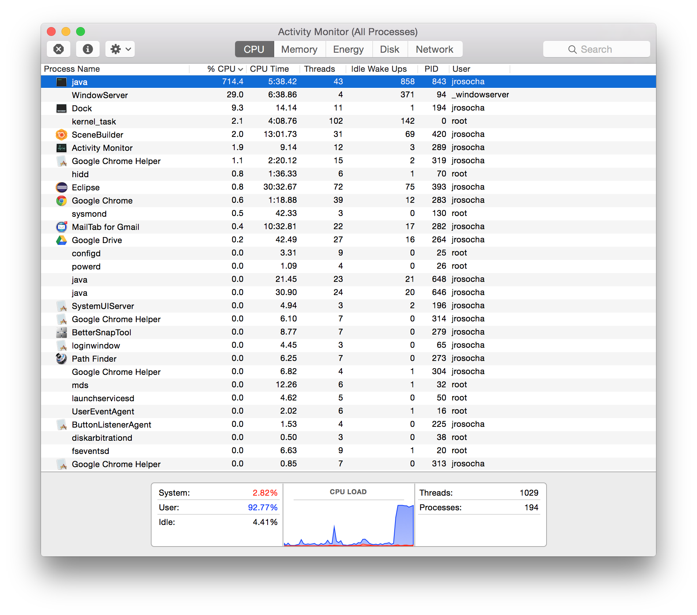

# jarvis
Elite Dangerous Trade Assistant 
Requires EliteOCR

Powered by OrientDb, Spring, and JavaFx

## Installation
* Install Elite:Dangerous .. or all of this will really be boring
* Install EliteOCR and learn how to use it. This app uses the csv exports. Mind what directory they get written to.

* Install Java 8 (JDK to do the compile). Its is the language this app uses.

* clone the git project from https://github.com/jrosocha/jarvisFx.git, you can just download the zip from github.
* cd to the cloned directory
* run gradlew or gradlew.bat (*nix or windows)

(At this point you can copy the build/install/jarvis folder somewhere else. It contains all the artifacts you require to run this app.

* cd ../bin (or build/install/jarvis/bin for those of you who are lost)

* run jarvis (or jarvis.bat)

## Example Usage

Set up your app via the settings tab. The 2 most important settings are the directory EliteOcr is writing your CSV files, and the Elite:Dangerous app directory. 
You'll also need verbose logging enabled in Elite:Dangerous for both EliteOCR and Jarvis.

Critical to Jarvis doing anything useful is EliteOCR. You'll need to import station you visit so that Jarvis has data to work with. Share them with your friends.

This is an example of a basic trade. Pick where you are, and how far you are willing to go, and Jarvis will brute force a solution for you.

This is a station's exchange data from the last time you imorted the data.

This is an example of a multistop trade solution. The profit is incremental for each stop.

This is an example of specific commodity trade solutions.

More commodity specific trade solutions.

Station to station exchange example.

Jarvis is multithreaded and CPU starved. he tries to brute force these trade solutions, and It will bring your CPU to a halt. I'll eventually provide a CPU throttle (its really easy, just not done yet). The 1 and 2 stop solutions come in fast. The 3 stop solutions will take a minute.

