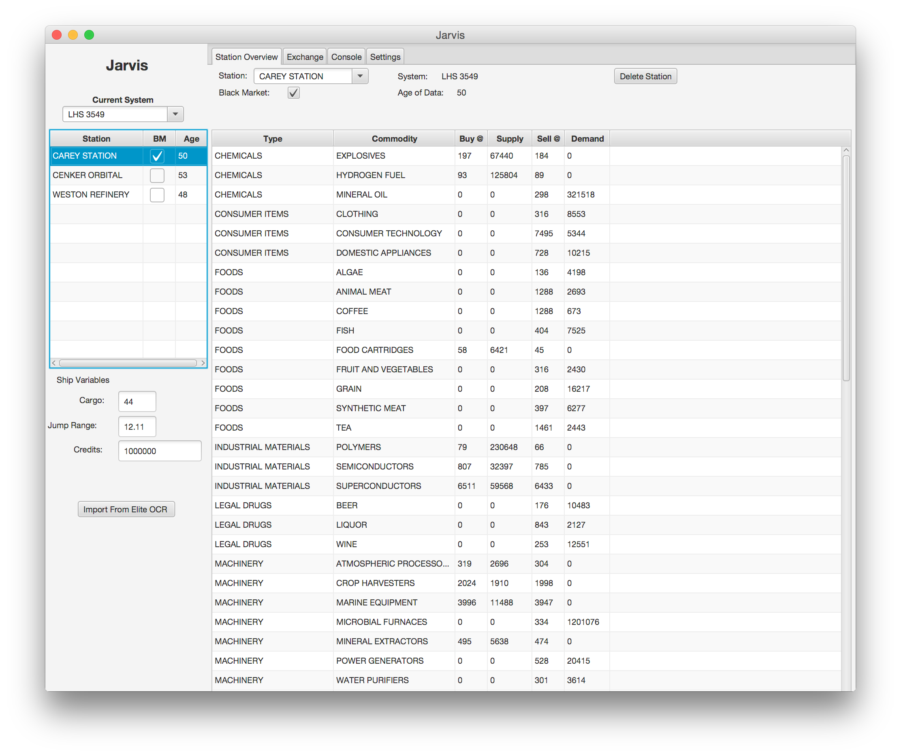

# jarvis
Elite Dangerous Trade Assistant 
Requires EliteOCR

Powered by OrientDb, Spring, and JavaFx

## Installation
* Install Elite:Dangerous .. or all of this will really be boring
* Install EliteOCR and learn how to use it. This app uses the csv exports. Mind what directory they get written to.

* Install Java 8 (JDK to do the compile). Its is the language this app uses.

* clone the git project from https://github.com/jrosocha/jarvisFx.git, you can just download the zip from github.
* cd to the cloned directory
* run gradlew or gradlew.bat (*nix or windows)

* cd build/install/jarvis/data
* edit jarvis-config.json. Change the line that reads like below to point to where yourElite OCR created .csv files go.
```
"eliteOcrScanDirectory" : "/Users/jrosocha/trade/Elite Dangerous",
```

(At this point you can copy the build/install/jarvis folder somewhere else. It contains all the artifacts you require to run this app.

* cd ../bin (or build/install/jarvis/bin for those of you who are lost)

* run jarvis (or jarvis.bat)




